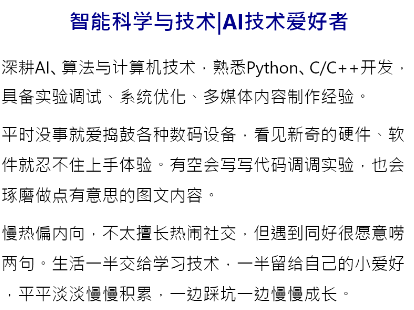

## 一、实验内容

### （一）实验目的

1. 制作一个名片小程序。
2. 快速学习了解小程序前端开发


### （二）实验任务

观看视频教学，并按照视频中的步骤，制作一个专属于自己的名片小程序（微信小程序名片），包括头图、文本描述，可以分享给别人。推荐使用AI工具生成专属于自己的名片头图。


### （三）实验步骤

1. 使用AI生成一张个人名片，我这里使用豆包AI的图片生成功能，制作了一张含头图的 16:9 商务风格的名片。

   

2. 编写`index.wxml`，给小程序页添加个人简介与文本描述，编写`index.wxss`，为文本添加效果。

   本次实验中，我给文本设置行高`line-height`、上下间距`padding`、居中显示`center`，给标题设置蓝色粗体，让视觉效果更加美观。

   

3. 参照视频教程的后半部分，我额外制作了一个带有个人信息的名片。继续编写`index.wxml`与`index.wxss`，以一张大图为底，logo和个人信息配合定位属性`position:absolute`设置方位偏移属性，让这些元素“贴”在背景大图上，可以添加阴影效果使其看起来更加真实。

   

最后将这三部分从上到下依次排列在一页，一个专属于自己的个人名片就做好了。


### （四）核心代码

#### index.wxml

```
<image mode="heightFix" src="https://img2.tofaka.com/autoupload/f/9vwlj/20260825/td0I/2848X1600/%E5%90%8D%E7%89%87%E5%A4%B4%E5%9B%BE%E4%BB%8B%E7%BB%8D%E7%94%9F%E6%88%90.png/webp"></image>
<view class="intro">戚晓旭|OUC</view>
<view class="body">
  <view class="title">智能科学与技术|AI技术爱好者</view>
  <view class="text">深耕AI、算法与计算机技术，熟悉Python、C/C++开发，具备实验调试、系统优化、多媒体内容制作经验。</view>
  <view class="text">平时没事就爱捣鼓各种数码设备，看见新奇的硬件、软件就忍不住上手体验。有空会写写代码调调实验，也会琢磨做点有意思的图文内容。</view>
  <view class="text">慢热偏内向，不太擅长热闹社交，但遇到同好很愿意唠两句。生活一半交给学习技术，一半留给自己的小爱好，平平淡淡慢慢积累，一边踩坑一边慢慢成长。</view>
</view>
<view class="img-wrap">
  <image class="card" mode="widthFix" src="../../img/card2.jpg"></image>
</view>
<image class="logo" src="../../img/logo.png"></image>
<view class="info">
  <view>姓名：戚晓旭</view>
  <view>电话：151-0099-3991</view>
  <view>邮箱：nulaxk@163.com</view>
</view>
```

#### index.wxss

```
/**index.wxss**/
page {
  padding-top: 150rpx;
  width: 80%;
}

.intro{
  font-size: 14px;
  text-align: center;
  color: gray;
}

.body{
  padding: 30rpx;
  line-height: 1.8;
}

.title{
  text-align: center;
  font-size: 20px;
  font-weight: bold;
  color: darkblue;
  padding-bottom: 10px;
}

.text{
  padding-bottom: 7px;
}

.img-wrap{
 justify-content: center;
 display: flex;
}

.card{
  margin: 10rpx;
  border-radius: 6px;
  box-shadow: 0 0 6px;
}

.logo{
  position: absolute;
  width: 80px;
  height: 80px;
  top: 700px;
  left: 60px;
}

.info{
  font-weight: bold;
  color: #5f687e;
  bottom: 100px;
  left: 170px;
}
```


### （五）实验结果

> 将做好的名片小程序上传，设置为体验版本，即可扫描测试二维码在手机端预览了，下图为iOS设备预览的名片效果：
>
> 


## 二、问题总结与体会

本次实验和实验一有不少相似之处，同样是在页面中展示图片与文字内容，但实验二中页面文本数量更多，如何给大批量文本统一设置样式效果，成为我一开始遇到的小问题。通过学习视频教程我了解到，`<view>`组件支持互相嵌套，`<image>`图片组件同样可以包裹在`<view>`容器内部。利用嵌套的容器，就可以统一给内部的文本、图片批量施加样式、布局与居中效果，不用逐个给每一个组件单独写样式，简化了代码编写。

实验过程中我也考虑到小程序代码包体积的限制，如果将全部大图放在本地项目文件夹内，容易造成包体积超限，导致无法上传提交。因此我把部分图片上传至图床，在页面中直接引用图片的网络URL进行渲染，将大图资源脱离本地代码包，避免包大小超标。 

整体来看本次实验难度不算高，但实操过程进一步加深了我对小程序 wxml、wxss 语法的理解，熟悉了组件嵌套、定位布局、网络图片引用这些开发技巧。这些学到的知识也为我之后开发个人小项目积累了实践经验，希望后续可以把本次实验学到的布局思路运用到这一实际开发当中。
