## 一、实验内容

> 📚本实验来自于周文洁老师的《微信小程序开发实战》第十四章。在学习了小程序的基础知识和各类API以后，尝试独立动手创建一个小程序前端综合设计实例。我们将从零开始详解如何模仿网易新闻实现一个基于模拟数据的简易高校新闻小程序。

### （一）实验目的

1. 制作一个名片小程序；
2. 综合所学知识创建完整的前端新闻小程序项目；
3. 快速学习了解小程序前端开发；
4. 能够在开发过程中熟练掌握真机预览、调试等操作。

### （二）实验任务

本项目一共需要3个页面，即首页、新闻页和个人中心页，其中首页和个人中心页需 要以tabBar的形式展示，可以点击tab图标互相切换。

#### 1. 首页功能需求：

	- 首页需要包含幻灯片播放效果和新闻列表；
	- 幻灯片至少要有3幅图片自动播放；
	- 点击新闻列表可以打开新闻全文。

#### 2. 新闻页功能需求：

 - 阅读新闻全文的页面需要显示新闻标题、图片、正文和日期；
 - 允许点击按钮将当前阅读的新闻添加到本地收藏夹中；
 - 已经收藏过的新闻也可以点击按钮取消收藏。

#### 3. 个人中心页功能需求：

	- 未登录状态下显示登录按钮，用户点击以后可以显示微信头像和昵称；
	- 登录后读取当前用户的收藏夹，展示收藏的新闻列表；
	- 收藏夹中的新闻可以直接点击查看内容；
	- 未登录状态下收藏夹显示为空。

### （三）实验步骤

1. 创建项目所需的3个页面文件，分别命名为index（首页）、detail（新闻页）和my（个人中心页）；创建images文件夹存放图片素材，utils文件夹存放`common.js` 公共文件，存放好准备使用的相关素材和文件。

   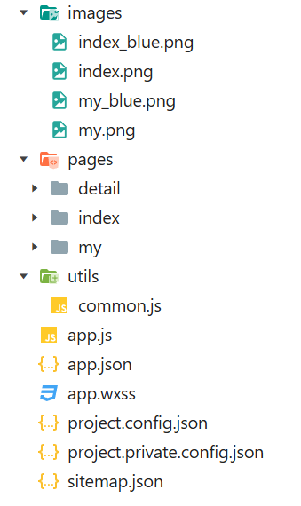

2. **设计首页导航栏与tabBar。**在`app.json`中修改`window`属性来自定义顶部导航栏效果，这里设置了蓝底白字贴合海大蓝色风格。后续追加tarBar相关属性代码添加“首页”与“我的”两个图标，使用素材自带的四张图片作为图标。

   > 顶部导航栏效果：

   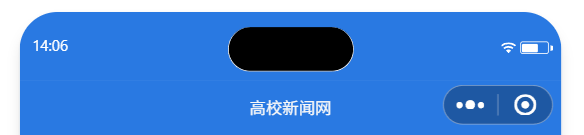

   > 选择“首页”的底部tabBar效果：

   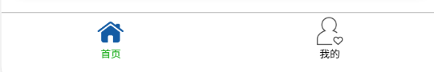

   > 选择“我的”的效果：

   

3. **设计首页效果。**首页主要实现轮播幻灯片与新闻列表两大模块，使用<swiper>组件实现自动轮播，设置 autoplay开启自动播放、 indicator‑dots显示轮播指示器，配置四张轮播图。新闻列表借助`wx:for`循环渲染模拟新闻数据，给列表条目绑定点击事件，携带新闻id参数完成页面跳转。

   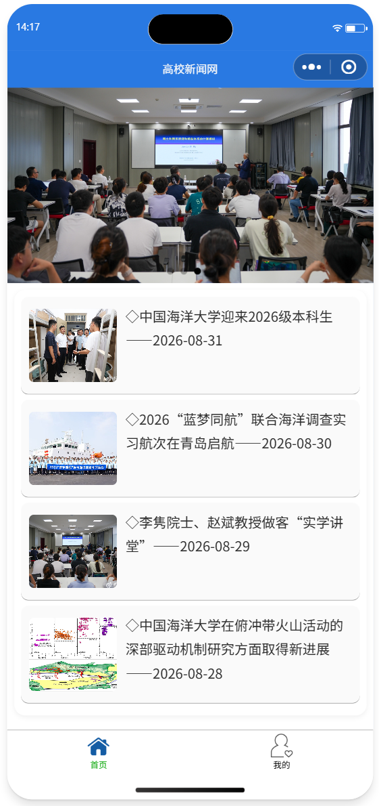

4. **完成新闻详情页开发。**详情页用于展示单条新闻完整内容，包含标题、新闻配图、正文、发布日期。对收藏按钮增加登录状态校验：未登录点击收藏，弹出弹窗提示用户先前往登录；仅登录成功后，才允许执行收藏/取消收藏逻辑。通过`wx:if/wx:else`区分“点击收藏”与“已收藏”两种按钮状态。利用小程序本地存储API `wx.setStorageSync`、`wx.removeStorageSync`实现收藏、取消收藏逻辑，打开页面时读取本地存储，结合全局登录标志`isLogin`共同判断当前新闻的收藏显示状态。开发过程中遇到图片样式异常问题，按照文档教程说明将图片宽度由100%修改为700rpx，解决图片无法正常渲染的bug。

   > 新闻详情页的排版效果图：

   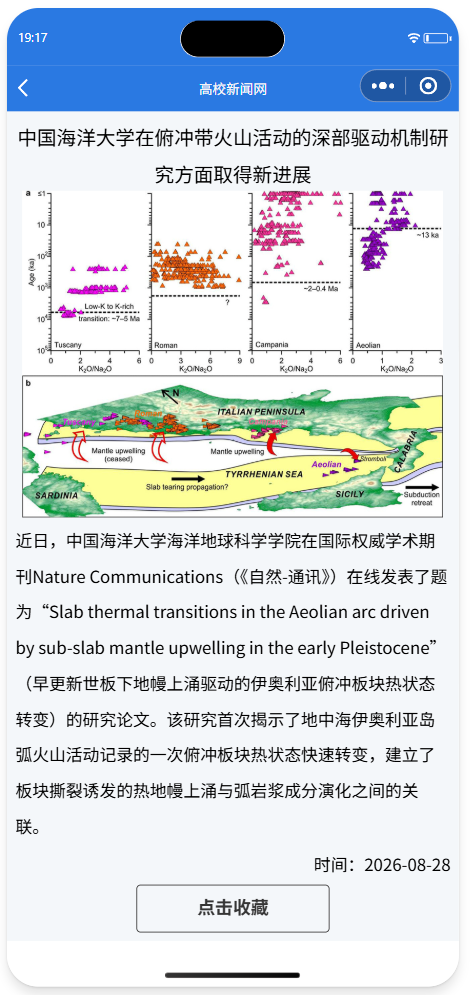

   > 未登录状态点击反馈：

   

   > 已登录状态点击收藏反馈：

   

   > 取消收藏反馈：

   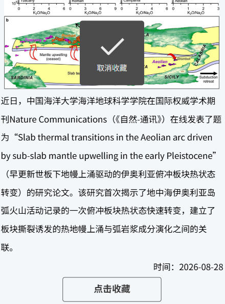

5. **开发个人中心页面。**受微信接口调整影响，原一键获取微信用户信息接口已废弃，我将本项目改为**模拟登录实现**：用户手动填写/更换头像昵称，可以一键更换当前微信头像、填写微信昵称。用户信息与收藏数据统一保存在小程序本地缓存。

   页面分为登录面板与我的收藏两个板块。未登录状态展示模拟登录按钮；登录成功后展示用户头像、昵称，同时读取小程序本地缓存，遍历缓存key，组装收藏新闻列表渲染。

   使用创建的登录状态标志`isLogin`做联动控制：未登录时直接清空收藏列表，不展示收藏内容；本地收藏数据保留不删除，等待登录之后再重新加载渲染收藏列表。

   为收藏新闻条目绑定点击跳转事件，可以直接打开对应新闻详情。给页面`onShow`生命周期添加逻辑：根据`isLogin`标志判断，登录则刷新收藏列表，未登录清空列表。

   > 个人中心未登录状态：

   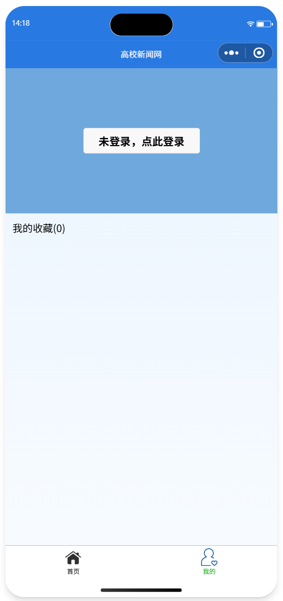

   > 个人中心登录状态、展示收藏列表：

   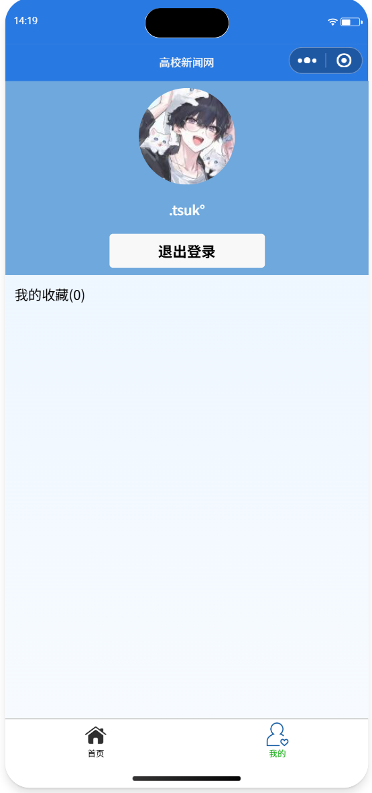

   > 更新个人信息界面：

   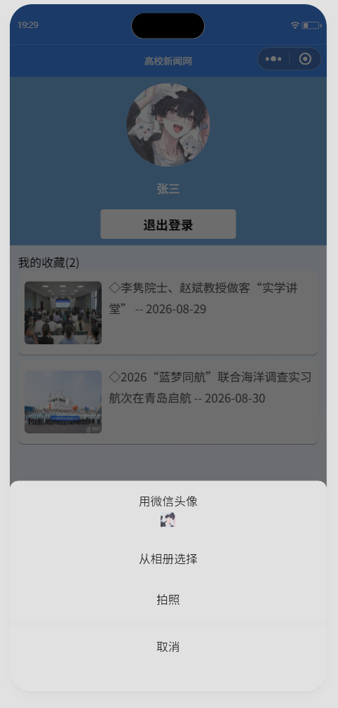

6. **公共数据与工具文件编写。**在`utils/common.js`编写模拟新闻数据，封装`getNewsList()`获取新闻列表、`getNewsDetail()`根据id查询单条新闻的函数，通过`module.exports`对外导出接口，各个页面通过相对路径引入该js文件获取模拟新闻数据。开发完成后清除各个页面data中用于样式调试的临时测试数据，引入正式新闻内容与图片。

7. **真机预览与调试。**配置小程序开发者工具，使用真机预览功能在手机上测试全部流程，完整测试轮播、新闻跳转、登录状态校验、未登录禁止收藏、收藏/取消收藏、模拟登录、退出登录后收藏列表清空、登录恢复收藏列表全部功能，通过Storage面板查看本地缓存中的用户信息、收藏数据是否正常读写。

### （四）核心代码片段

#### 1. app.json配置（导航栏与tabBar）

```
{
  "pages": [
    "pages/index/index",
    "pages/my/my",
    "pages/detail/detail"
  ],
  "window": {
    "navigationBarTextStyle": "white",
    "navigationBarTitleText": "高校新闻网",
    "navigationBarBackgroundColor": "#2979E2"
  },
  "tabBar": {
    "list": [{
      "pagePath": "pages/index/index",
      "text": "首页",
      "iconPath": "images/index.png",
      "selectedIconPath": "images/index_blue.png"
    }, 
    {
      "pagePath": "pages/my/my",
      "text": "我的",
      "iconPath": "images/my.png",
      "selectedIconPath": "images/my_blue.png"
    }  
  ]
  },
  "style": "v2",
  "componentFramework": "glass-easel",
  "sitemapLocation": "sitemap.json",
  "lazyCodeLoading": "requiredComponents"
}
```

#### 2. 首页index.wxml（轮播与新闻列表）

```
<!--pages/index/index.wxml-->
<!--幻灯片滚动-->
<swiper indicator-dots="true" autoplay="true" interval="5000" duration="500">
  <block wx:for="{{swiperImg}}" wx:key='swiper{{index}}'>
    <swiper-item>
      <image src="{{item.src}}" mode="aspectFill"></image>
    </swiper-item>
  </block>
</swiper>
<!--新闻列表-->
<view id='news-list'>
  <view class='list-item' wx:for="{{newsList}}" wx:for-item="news" wx:key="{{news.id}}" bindtap='goToDetail' data-id='{{news.id}}'>
    <image src='{{news.poster}}' mode="aspectFill"></image>
    <text>◇{{news.title}}——{{news.add_date}}</text>
  </view>
</view>
```

#### 3. detail.js 增加登录校验的收藏逻辑

```
var common = require("../../utils/common.js")

Page({

  onLoad: function(options){
    let id = options.id
    let isLogin = wx.getStorageSync('loginFlag') || false
    var article = wx.getStorageSync(id)
    if(article != ''  && isLogin){
      this.setData({
        article: article,
        isAdd: true,
        isLogin: isLogin
      })
    }
    else{
      let result = common.getNewsDetail(id)
      if(result.code == '200'){
        this.setData({
          article: result.news, 
          isAdd: false,
          isLogin: isLogin
        })
      }
    }
    // let result = common.getNewsDetail(id)
    // if(result.code == '200'){
    //   this.setData({article:result.news})
    // }
    
  },

  addFavorites: function(options){
    if(!this.data.isLogin){
      wx.showToast({
        title:"请先登录!",
        icon:"none"
      })
      return;
    }
    let article = this.data.article;
    wx.setStorageSync(article.id, article);
    this.setData({isAdd: true});
    wx.showToast({title:"收藏成功"})
  },

  cancelFavorites: function(){
    if(!this.data.isLogin){
      wx.showToast({
        title:"请先登录!",
        icon:"none"
      })
      return;
    }
    let article = this.data.article;
    wx.removeStorageSync(article.id);
    this.setData({isAdd: false});
    wx.showToast({title:"取消收藏"})
  },
})
```

#### 4. my.js 包含登录与收藏状态绑定

```
var common = require("../../utils/common.js")

Page({

  data:{
    isLogin: false,
    src: "/images/my.png",
    nickName: "微信用户",
    editNick: false, 
    newsList: []
  },

  onLoad: function () {
    //读取缓存，刷新页面保留登录状态
    let userInfo = wx.getStorageSync("userInfo")
    let loginFlag = wx.getStorageSync("loginFlag")
    if(loginFlag){
      if(userInfo){
        this.setData({
          isLogin: true,
          src: userInfo.src,
          nickName: userInfo.nickName
        })
      }
    }
    this.loadFavorites()
  },

  //一键登录：直接进入登录状态，先用默认头像、默认昵称
  quickLogin(){
    let userInfo = wx.getStorageSync("userInfo")
    if(userInfo){
      this.setData({
        isLogin:true,
        src: userInfo.src,
        nickName: userInfo.nickName
      })
    }else{
      this.setData({
        isLogin:true
      })
    }
    //登录成功代码处
    wx.setStorageSync("loginFlag", true)
    this.saveUserToStorage()
    this.loadFavorites()
  },

  //点击头像，更换头像
  onChooseAvatar(e){
    this.setData({
      src:e.detail.avatarUrl
    })
    this.saveUserToStorage()
  },

  //点击昵称文字，开启编辑模式
  startEditNick(){
    this.setData({editNick:true})
  },

  //失去焦点保存昵称
  saveNickName(e){
    this.setData({
      nickName:e.detail.value,
      editNick:false
    })
    this.saveUserToStorage()
  },

  //保存用户信息到本地缓存
  saveUserToStorage(){
    let user = {
      src:this.data.src,
      nickName:this.data.nickName
    }
    wx.setStorageSync("userInfo",user)
  },

  //退出登录
  logout(){
    wx.setStorageSync("loginFlag", false)
    wx.showModal({
      title:"提示",
      content:"确定要退出登录吗？",
      success:(res)=>{
        if(res.confirm){
          this.setData({
            isLogin:false,
            src:"/images/my.png",
            nickName:"微信用户",
            editNick:false,
            newsList: []
          })
          wx.showToast({title:"已退出登录"})
        }
      }
    })
  },

  //加载收藏列表
  loadFavorites(){
    let loginFlag = wx.getStorageSync("loginFlag") || false
    // 未登录，直接清空收藏列表，不读取缓存
    if(!loginFlag){
      this.setData({
        newsList: []
      })
      return;
    }
    let info = wx.getStorageInfoSync()
    let keys = info.keys
    let myList = []
    for(var i = 0; i < keys.length; i++){
      let obj = wx.getStorageSync(keys[i])
      if(obj && obj.id){
        myList.push(obj)
      }
    }

    this.setData({
      newsList: myList,
    })
  },

  onShow: function(){
    if(this.data.isLogin){
      this.loadFavorites()
    }
  },

  goToDetail: function(e){
    let id = e.currentTarget.dataset.id;
    wx.navigateTo({
      url: "../detail/detail?id=" + id
    })
  }
})
```

### （五）实验结果

项目完成后，小程序可以正常切换首页与个人中心tab。首页轮播图自动循环播放，点击新闻条目正常跳转新闻详情页；

> 首页详情图：
>
> 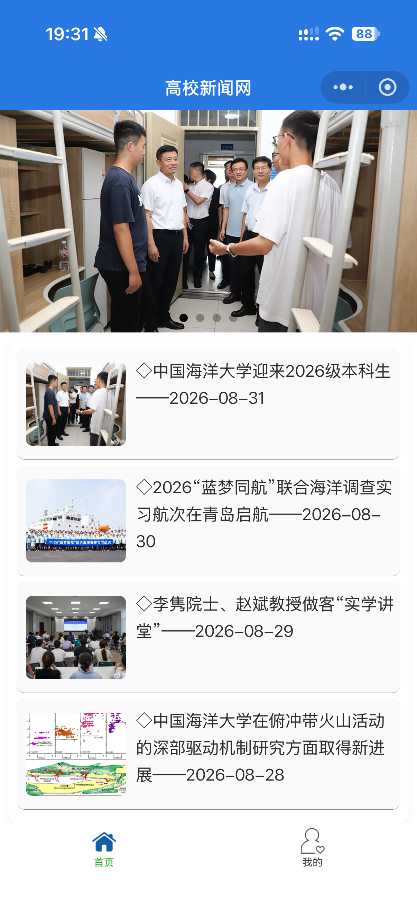

新闻详情页：未登录点击收藏会弹出提示弹窗，登录成功后才可以执行收藏、取消收藏；

> 新闻详情页：
>
> 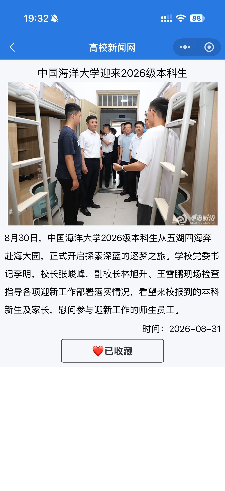

个人中心页面：采用模拟登录，用户头像昵称保存在本地缓存，支持更换个人信息；未登录时收藏列表清空，但收藏数据不会被删除；登录之后读取本地缓存重新渲染收藏列表；点击收藏列表新闻可以正常跳转详情页面。

> 个人中心页面：
>
> 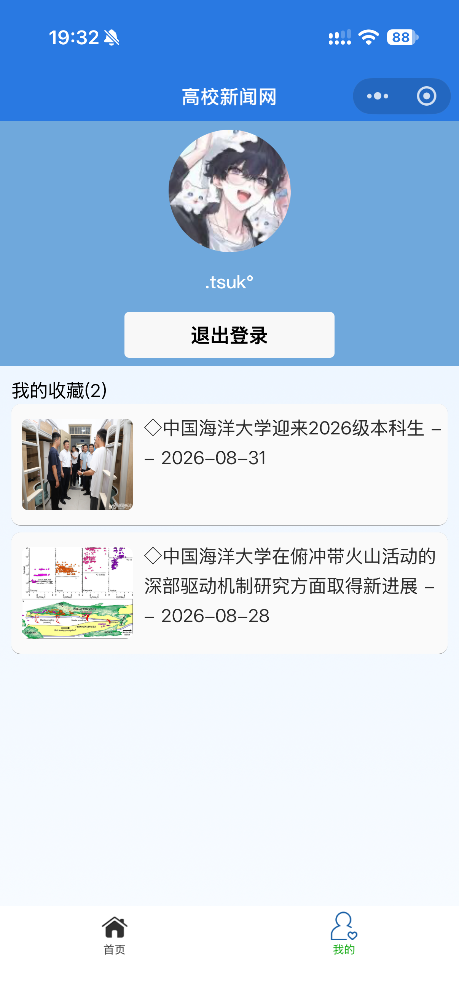

退出登录后，收藏列表清空，打开新闻详情页按钮重置为“点击收藏”，再次登录即可恢复全部收藏记录。

> 退出登录页面：
>
> 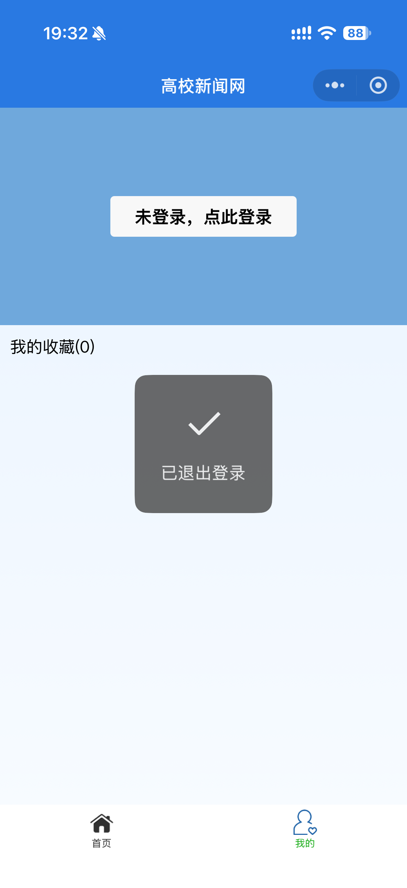

## 二、问题总结与体会

本次实验是综合性的微信小程序开发实验，整合页面配置、tabBar、swiper轮播、页面传参、本地存储、用户登录状态管理等多项知识点，完整实现一套新闻小程序前端。实验过程中我遇到了若干问题，结合微信现有的接口限制，通过修改部分实现逻辑、增加状态标志、调试开发者工具逐一解决了这些问题。

#### 第一个遇到的问题：**微信原一键获取用户信息`getUserInfo`接口在几年前就已经废弃，无法直接一键获取微信头像昵称**。
> 按照文档原始教程的写法已经不能直接运行，获取的只有默认白色头像和“微信用户”默认昵称，真实个人小程序没有办法直接一键拉起微信授权拿到用户信息。

我的解决方案是实现模拟登录，把用户头像、昵称信息和新闻收藏一样，全部存储在小程序本地缓存Storage中，支持手动修改、更换个人信息；每次进入个人中心页面读取缓存恢复用户信息，不再依赖微信授权接口，适配当前小程序接口规范。

#### 第二个问题：收藏功能缺少登录校验，未登录状态依旧可以执行收藏操作，交互逻辑不符合项目预期。
最初代码不管用户是否登录，都可以点击收藏按钮写入本地存储。于是我在收藏、取消收藏两个函数入口处增加`isLogin`登录状态判断，如果用户处于未登录状态，调用`wx.showModal`弹出弹窗提示用户先登录，直接return终止收藏逻辑；只有登录状态下才允许读写收藏缓存，完善业务权限校验。

#### 第三个问题：收藏列表没有和登录状态做绑定。退出登录之后，我的收藏页面仍然展示之前收藏的新闻；退出登录后打开新闻详情，页面依旧保留登录前的 “已收藏” 状态，逻辑出现混乱。

分析问题根源：本地缓存的收藏数据会一直保留，页面不会跟随登录标志自动清空视图。我增加全局登录标志`isLogin`，在`my`页面的`onShow`生命周期做判断：如果`isLogin`为true，则读取本地缓存加载收藏列表；如果未登录，仅仅清空页面上的收藏列表视图，**不会删除Storage里面真实收藏数据**。

同时在新闻详情页`onLoad`读取新闻时，增加登录状态判断：未登录时强制把按钮状态置为 “点击收藏”。这样退出登录，收藏列表清空，新闻页面全部恢复未收藏显示；一旦用户重新登录，再重新读取本地缓存，把之前收藏过的新闻加载展示出来，做到视图和登录状态同步，底层数据持久保存。

#### 第四个是页面跳转传参接收异常，一开始页面点击新闻后detail页面拿不到新闻id。

排查后发现wxml中`data‑id`书写出现拼写错误，同时js读取`e.currentTarget.dataset.id`，修正拼写错误后页面传参恢复正常。

本次实验让我对小程序完整项目开发流程有了完整认知，熟悉`app.json`全局页面与tabBar配置，掌握页面之间通过url携带参数完成数据传递；深度理解`wx.setStorageSync`本地存储API的用法，可以区分**视图清空**和**底层缓存删除**两种行为；同时对小程序生命周期`onLoad`、`onShow`有了更深理解，分清页面只加载一次和每次页面显示刷新数据的区别。

微信小程序接口会持续迭代更新，一些文本教程中的旧接口可能会被官方废弃，实际开发不能完全照搬书本代码，要结合官方最新规范做改造。真机预览调试也锻炼了排错能力，我也学会利用Console控制台、Storage存储面板定位bug。
> 📌课程建议：实验文档示例部分接口存在版本过时或弃用问题，希望课堂上可以补充微信接口变更说明，增加适配新版本的拓展讲解，方便做实验时少踩版本坑。
