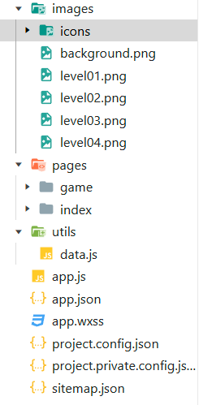
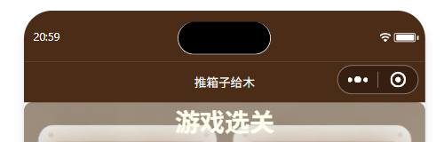
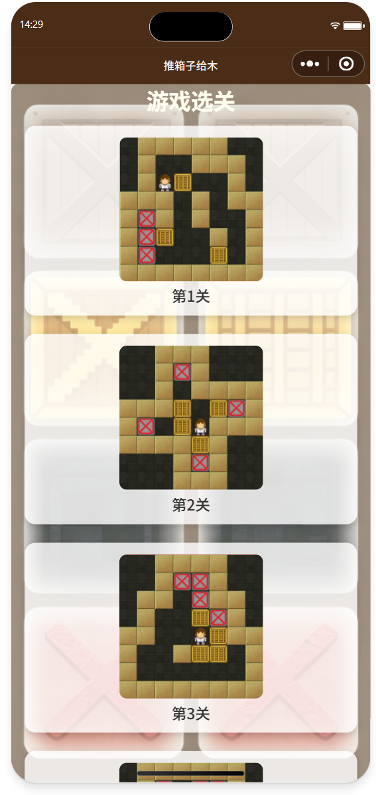
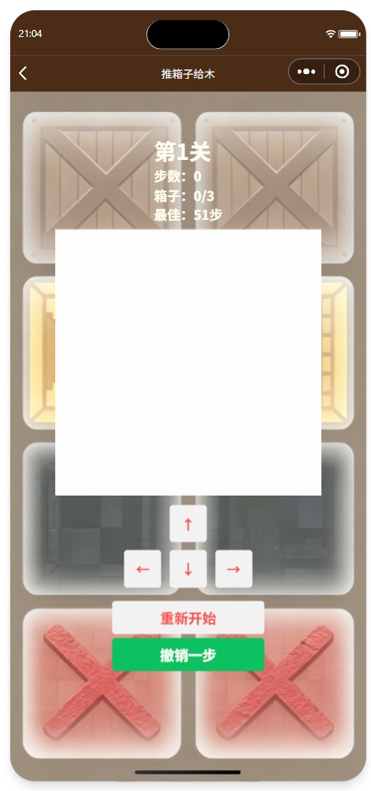
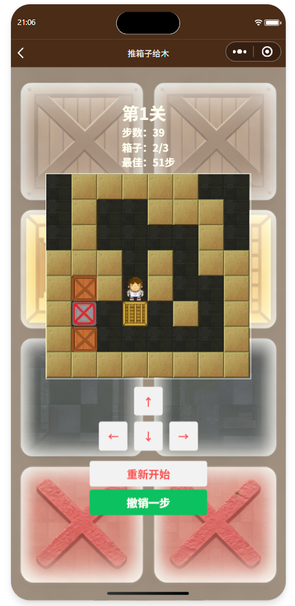
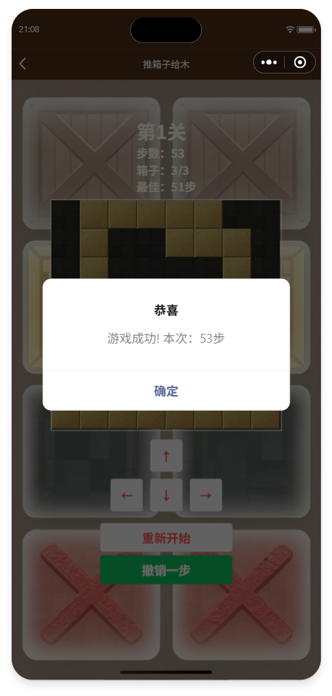

## 一、实验内容
> 本实验来自于周文洁老师的《微信小程序开发实战》第十三章。在学习了<canvas>组件和小程序界面API中绘图相关的用法以后，我们尝试制作简易的推箱子小游戏。
### （一）实验目的
1. 综合应用所学知识创建完整的推箱子游戏；
2. 熟练掌握小程序<canvas>画布组件以及绘图相关API；
3. 掌握小程序页面创建、页面配置、页面之间跳转传参的实现方式。
4. 掌握小程序模拟器调试，排查画布渲染、游戏逻辑相关bug。
### （二）实验任务
本实验一共需要2个页面，即首页（选关页面）和游戏页面面，首页用于关卡菜单展示，点击关卡后跳转游戏画面。
#### 1.首页功能需求
- 首页需要包换标题和关卡列表；
- 关卡至少要有4个关卡选项， 每个关卡显示预览图片和第几关；
- 点击关卡列表可以打开对应的游戏画面，携带关卡编号参数。
#### 2.游戏页功能需求
- 游戏页面需要显示第几关、游戏画面、方向键和"重新开始"按钮；
- 点击方向键可以使游戏主角自行移动或推动箱子前进，墙体阻挡移动；
- 游戏画面由8x8的小方块组成，主要包括地板、围墙、箱子、游戏主角和目的地；
- 点击"重新开始"按钮可以将箱子和游戏主角回归出事位置并重新开始游戏；
- 所有箱子全部推送到终点位置，弹出弹窗提示游戏成功。
### （三）实验步骤
1. 创建boxGame空白小程序项目，创建项目所需的两个页面文件，分别命名为index（首页）、game（游戏页面）；
创建images文件夹存放图片素材，images内部新建icons子文件夹存放游戏方块图标；创建utils文件夹，新建data.js公共文件，倒入关卡预览图、游戏图标素材。
> 为了保证游戏观感，我这里选择了CSDN中[__](https://download.csdn.net/download/qq_54169998/81179976?ops_request_misc=elastic_search_misc&request_id=237ccbab8adf412db18ede9f0e07d614&biz_id=1&utm_medium=distribute.wap_search_result.none-task-download-2~all~ElasticSearch~search_v2-8-81179976-null-null.nonecase&utm_term=%E6%8E%A8%E7%AE%B1%E5%AD%90%E6%B8%B8%E6%88%8F%E5%9B%BE%E7%89%87%E7%B4%A0%E6%9D%90&spm=1018.2118.3001.4187.6)文章中分享的图片素材，在原有所需素材的基础上新增了两张效果重叠的图片素材，用于增强游戏交互效果。



2. 删除项目自带的多余页面、文件、文件夹，自动补全`Page()`、`App()`模板。
修改`app.json`的`pages`数组注册两个页面；修改`window`熟悉自定义导航栏，设置导航栏标题、背景色。编写`app.wxss`全局公共样式，定义页面容器、标题通用样式。



3. **首页选关页面开发**。编写`index.wxml`布局，包含页面标题与关卡列表；使用`wx:for`循环渲染关卡数组，每一项展示关卡预览图片与关卡序号；
给关卡条目绑定`bindtap`点击事件，通过`data-level`携带关卡下标参数。编写`index.wxss`完成列表、图片样式。
在`index.js`中定义关卡图标数组，实现`chooseLevel`点击函数，调用`wx.navigateTo`跳转到游戏页面，url拼接关卡下标参数。



4. **公共关卡数据编写**。在`utils/data.js` 中定义map1~map4共四组8x8二位数组作为4个关卡地图数据；数字代表地图元素：
0为外围、1为墙、2为道路、3为终点、4为箱子、5为人物。
使用`module.exports`对外导出maps数组，游戏页面通过相对路径引入该文件读取关卡数据。
5. **游戏页面布局开发**。编写`game.wxml`，完成关卡标题、步数计数、关卡完成度、`canvas`画布、上下左右方向按钮、重新开始、撤销一步按钮布局；
编写`game.wxss`设置画布、按钮尺寸排版；为方向键绑定`up`、`down`、`left`、`right`点击事件，为重新开始按钮绑定`restartGame`事件，为撤销按钮绑定`__`事件。
在开发工具天假编译模式，设置启动参数`level=0`，方便单独调试游戏页面。



6. **游戏加载逻辑开发**。

	1). 在`game.js`顶部引入`data.js`获取关卡地图数据；定义全局map地图数组、box箱子数组、方块宽度w、主角行列坐标row、col。
	
	2). `onLoad`生命周期接收首页传递过来的`level`关卡参数，创建`canvas`绘图上下文，调用`initMap()`初始化地图、`drawCanvas()`绘制画布。
	
	3). `initMap()`函数：读取对应关卡原始地图，双重循环解析二维数组，分离背景地图数据与箱子数据，记录游戏主角初始行、列坐标。
	
	4). `drawCanvas`函数：清空画布，循环便利地图，使用`drawImage`绘制墙体、道路、终点；叠加绘制箱子，最后绘制游戏主角，调用`draw`完成画布渲染。
	
	5). 实现上下左右四个方向移动函数，做碰撞逻辑判断：遇到墙体不能移动；前方为箱子判断箱子下一个是否可通行，可通行则推动箱子，更新主角坐标；调用`drawCanvas`刷新画面。
	
	6). 编写`isWin`函数双重循环遍历地图，判断所有箱子是否全部处于终点位置；编写`checkWin`函数，游戏胜利调用`wx.showModel`弹出成功提示；在每一个方向移动函数末尾调用`checkWin`检测胜利。
	
	7). 编写`restartGame`函数，调用`initMap`重新初始化当前关卡地图，重新绘制画布，实现游戏重置。

   	8). 编写`undoStep`函数，采取栈结构存储已行动步数，撤销弹出最后一步并重新绘制地图。





7. **模拟器调试**。测试完整游戏流程：首页点击不同关卡跳转游戏页面；方向键移动人物、推动箱子；撞墙无法移动；箱子到位的贴图变更；游戏人物到达终点时的贴图变更；全部箱子到位弹出成功提示；点击重新开始恢复初始游戏状态；点击撤销一步返回上一步操作。
通过Console控制台排查JS报错，检查`canvas`绘制是否正常。
### （四）核心代码片段
#### 1.app.json 全局配置

```
{
  "pages": [
    "pages/index/index",
    "pages/game/game"
  ],
  "window": {
    "navigationBarTextStyle": "white",
    "navigationBarTitleText": "推箱子给木",
    "navigationBarBackgroundColor": "#4A2C17"
  },
  "style": "v2",
  "componentFramework": "glass-easel",
  "sitemapLocation": "sitemap.json",
  "lazyCodeLoading": "requiredComponents"
}
```

#### 2.data.js 地图数据导出

```
//关卡1
var map1 =[
  [0, 1, 1, 1, 1, 1, 0, 0],
  [0, 1, 2, 2, 1, 1, 1, 0],
  [0, 1, 5, 4, 2, 2, 1, 0],
  [1, 1, 1, 2, 1, 2, 1, 1],
  [1, 3, 1, 2, 1, 2, 2, 1],
  [1, 3, 4, 2, 2, 1, 2, 1],
  [1, 3, 2, 2, 2, 4, 2, 1],
  [1, 1, 1, 1, 1, 1, 1, 1]
]
//关卡2
var map2 =[
  [0, 0, 1, 1, 1, 0, 0, 0],
  [0, 0, 1, 3, 1, 0, 0, 0],
  [0, 0, 1, 2, 1, 1, 1, 1],
  [1, 1, 1, 4, 2, 4, 3, 1],
  [1, 3, 2, 4, 5, 1, 1, 1],
  [1, 1, 1, 1, 4, 1, 0, 0],
  [0, 0, 0, 1, 3, 1, 0, 0],
  [0, 0, 0, 1, 1, 1, 0, 0]
]
//关卡3
var map3 = [
  [0, 0, 1, 1, 1, 1, 0, 0],
  [0, 0, 1, 3, 3, 1, 0, 0],
  [0, 1, 1, 2, 3, 1, 1, 0],
  [0, 1, 2, 2, 4, 3, 1, 0],
  [1, 1, 2, 2, 5, 4, 1, 1],
  [1, 2, 2, 1, 4, 4, 2, 1],
  [1, 2, 2, 2, 2, 2, 2, 1],
  [1, 1, 1, 1, 1, 1, 1, 1]
]
//关卡4
var map4 =[
  [0, 1, 1, 1, 1, 1, 1, 0],
  [0, 1, 3, 2, 3, 3, 1, 0],
  [0, 1, 3, 2, 4, 3, 1, 0],
  [1, 1, 1, 2, 2, 4, 1, 1],
  [1, 2, 4, 2, 2, 4, 2, 1],
  [1, 2, 1, 4, 1, 1, 2, 1],
  [1, 2, 2, 2, 5, 2, 2, 1],
  [1, 1, 1, 1, 1, 1, 1, 1]
]

module.exports = {
  maps: [map1, map2, map3, map4]
}
```

#### 3.index.wxml 关卡列表

```
<view class='bg-wrap'>
  <image class="bg-img" src="../../images/background.png" mode="aspectFill"></image>
</view>

<view class='container'>
  <!--标题-->
  <view class = 'title'>游戏选关</view>
  <!--关卡列表-->
    <view class='levelBox'>
    <view class='box' wx:for='{{levels}}' wx:key='levels{{index}}' bindtap='chooseLevel' data-level='{{index+1}}'>
      <image src='/images/{{item}}'></image>
      <text>第{{index+1}}关</text>
    </view>
  </view>
</view>
```

#### 4.index.js 关卡跳转

```
  data: {
    levels: [
      'level01.png',
      'level02.png',
      'level03.png',
      'level04.png'
    ]
  },

  chooseLevel: function(e){
    let level = e.currentTarget.dataset.level
    wx.navigateTo({
      url: '../game/game?level='+level
    })
  },
```

#### 5.game.js 初始化地图与胜利判断

```
var data = require('../../utils/data.js')
//地图图层数据
var map = [
  [0, 0, 0, 0, 0, 0, 0, 0],
  [0, 0, 0, 0, 0, 0, 0, 0],
  [0, 0, 0, 0, 0, 0, 0, 0],
  [0, 0, 0, 0, 0, 0, 0, 0],
  [0, 0, 0, 0, 0, 0, 0, 0],
  [0, 0, 0, 0, 0, 0, 0, 0],
  [0, 0, 0, 0, 0, 0, 0, 0],
  [0, 0, 0, 0, 0, 0, 0, 0]
]
//箱子图层数据
var box = [
  [0, 0, 0, 0, 0, 0, 0, 0],
  [0, 0, 0, 0, 0, 0, 0, 0],
  [0, 0, 0, 0, 0, 0, 0, 0],
  [0, 0, 0, 0, 0, 0, 0, 0],
  [0, 0, 0, 0, 0, 0, 0, 0],
  [0, 0, 0, 0, 0, 0, 0, 0],
  [0, 0, 0, 0, 0, 0, 0, 0],
  [0, 0, 0, 0, 0, 0, 0, 0]
]
//方块的宽度
var w = 40
var row = 0
var col = 0
var gameOver = false
//移动历史记录栈，用于撤销
var history = []

// pages/game/game.js
Page({
  /**
   * 页面的初始数据
   */
  data: {
    level: 1,
    step: 0,
    okBox: 0,
    totalBox: 0,
    bestText: "无"
  },

  //保存当前快照进历史
  saveSnapshot(){
    //深拷贝箱子数组
    let boxCopy = box.map(item=>[...item])
    history.push({
      r: row,
      c: col,
      boxArr: boxCopy
    })
  },

  //刷新箱子进度（多少箱子到达红点）
  refreshBoxStatus(){
    let ok = 0
    for(let i=0;i<8;i++){
      for(let j=0;j<8;j++){
        if(box[i][j]===4 && map[i][j]===3){
          ok++
        }
      }
    }
    this.setData({
      okBox: ok
    })
  },

  //读取本关最佳步数
  loadBestRecord(levelNum){
    //取出全部关卡记录
    let allRecord = wx.getStorageSync('sokobanBest') || {}
    let best = allRecord[levelNum]
    if(best === undefined){
      this.setData({bestText:"无"})
    }else{
      this.setData({bestText: best + "步"})
    }
  },

  //保存并判断是否新纪录
  saveBestIfNeed(levelNum,currentStep){
    let allRecord = wx.getStorageSync('sokobanBest') || {}
    let oldBest = allRecord[levelNum]
    //无记录 / 当前步数更少 → 新纪录
    if(oldBest === undefined || currentStep < oldBest){
      allRecord[levelNum] = currentStep
      wx.setStorageSync('sokobanBest',allRecord)
      return true
    }
    return false
  },

  /**
   * 生命周期函数--监听页面加载
   */
  onLoad: function(options) {
    let level = parseInt(options.level)
    this.setData({
      level: level
    })
    //读取最佳记录
    this.loadBestRecord(level)
    //创建画布上下文
    this.ctx = wx.createCanvasContext('myCanvas')
    //初始化地图，maps下标从0开始，第1关→索引0
    this.initMap(level - 1)
    this.drawCanvas()
  },

  initMap: function(levelIdx){
    gameOver = false
    history = []
    let total = 0
    //读取原始的游戏地图数据
    let mapData = data.maps[levelIdx]
    for (var i = 0; i<8; i++){
      for (var j= 0;j<8;j++){
        box[i][j]= 0
        map[i][j] = mapData[i][j]
        if (mapData[i][j]== 4){
          box[i][j] = 4
          map[i][j]=2
          total++
        }
        else if (mapData[i][j] == 5) {
          map[i][j] = 2
          row =i
          col = j
        }
      }
    }
    this.setData({
      step: 0,
      totalBox: total
    })
    this.refreshBoxStatus()
  },

  drawCanvas: function(){
    let ctx = this.ctx
    //清空画布
    ctx.clearRect(0, 0, 320, 320)
    //使用双重for循环绘制8x8的地图
    for (var i = 0;i<8; i++){
      for (var j= 0;j<8; j++){
        //默认是道路
        let img = 'floor'
        if (map[i][j] == 1){
          img = 'wall'}
        else if (map[i][j] == 3) {
          img = 'point'
        }
        //绘制地图
        ctx.drawImage('/images/icons/'+ img + '.jpg', j * w, i * w, w, w)
        if (box[i][j] == 4) {
          //叠加绘制箱子
          let boxImg;
          if(map[i][j] == 3){
            boxImg = 'boxyes'
          }
          else{
            boxImg = 'box'
          }
          ctx.drawImage('/images/icons/' + boxImg + '.jpg', j * w, i * w, w, w)
        }
      }
    }
    //====改动：判断人物脚下位置切换图片素材====
    let playerImg;
    if(map[row][col] === 3){
      //人物站在终点红点上，使用新素材
      playerImg = 'maninfloor'
    }else{
      //普通地板
      playerImg = 'man'
    }
    ctx.drawImage('/images/icons/' + playerImg + '.jpg', col * w, row * w, w, w)
    ctx.draw()
  },

  up: function() {
    if(gameOver) return
    if(row>0){
      //先存快照（移动前状态）
      this.saveSnapshot()
      let moved = false
      if (map[row - 1][col] != 1 && box[row - 1][col] != 4){
        row=row-1
        moved = true
      }
      else if (box[row - 1][col] == 4) {
        if(row- 1>0){
          if (map[row - 2][col]!= 1 && box[row - 2][col] != 4) {
            box[row - 2][col] = 4
            box[row - 1][col] = 0
            row = row - 1
            moved = true
          }
        }
      }
      if(moved){
        this.setData({
          step: this.data.step + 1
        })
        this.refreshBoxStatus()
      }else{
        //没移动成功，撤销刚刚压入的快照
        history.pop()
      }
      this.drawCanvas()
      this.checkWin()
    }
  },

  down: function(){
    if(gameOver) return
    if (row <7){
      this.saveSnapshot()
      let moved = false
      if (map[row + 1][col]!= 1 && box[row + 1][col] != 4) {
        row = row + 1
        moved = true
      }
      else if (box[row + 1][col] == 4) {
        if (row + 1<7){
          if (map[row + 2][col] != 1 && box[row + 2][col] != 4) {
            box[row + 2][col] = 4
            box[row + 1][col] = 0
            row =row + 1
            moved = true
          }
        }
      }
      if(moved){
        this.setData({
          step: this.data.step + 1
        })
        this.refreshBoxStatus()
      }else{
        history.pop()
      }
      this.drawCanvas()
      this.checkWin()
    }
  },

  left: function() {
    if(gameOver) return
    if(col>0){
      this.saveSnapshot()
      let moved = false
      if (map[row][col - 1]!= 1 && box[row][col - 1]!= 4) {
        col = col - 1
        moved = true
      }
      else if (box[row][col - 1] == 4) {
        if (col - 1>0){
          if (map[row][col - 2]!= 1 && box[row][col - 2]!= 4) {
            box[row][col - 2] = 4
            box[row][col - 1] = 0
            col = col - 1
            moved = true
          }
        }
      }
      if(moved){
        this.setData({
          step: this.data.step + 1
        })
        this.refreshBoxStatus()
      }else{
        history.pop()
      }
      this.drawCanvas()
      this.checkWin()
    }
  },

  right: function() {
    if(gameOver) return
    if(col < 7){
      this.saveSnapshot()
      let moved = false
      if (map[row][col + 1]!= 1 && box[row][col + 1]!= 4) {
        col = col + 1
        moved = true
      }
      else if (box[row][col + 1] == 4) {
        if (col + 1 < 7){
          if (map[row][col + 2]!= 1 && box[row][col + 2]!= 4) {
            box[row][col + 2] = 4
            box[row][col + 1] = 0
            col = col + 1
            moved = true
          }
        }
      }
      if(moved){
        this.setData({
          step: this.data.step + 1
        })
        this.refreshBoxStatus()
      }else{
        history.pop()
      }
      this.drawCanvas()
      this.checkWin()
    }
  },

  //撤销一步
  undoStep(){
    //通关之后禁止撤销
    if(gameOver) return;
    if(history.length === 0){
      wx.showToast({title:'没有可撤销步骤',icon:'none'})
      return
    }
    let last = history.pop()
    row = last.r
    col = last.c
    //恢复箱子数组
    for(let i=0;i<8;i++){
      for(let j=0;j<8;j++){
        box[i][j] = last.boxArr[i][j]
      }
    }
    this.setData({
      step: Math.max(0,this.data.step - 1)
    })
    this.refreshBoxStatus()
    this.drawCanvas()
},

  isWin: function(){
    for (var i = 0; i<8; i++){
      for (var j= 0;j<8; j++){
        if (box[i][j] == 4 && map[i][j]!= 3){
          return false
        }
      }
    }
    return true
  },

  checkWin:function(){
    if (this.isWin()){
      gameOver = true
      let curStep = this.data.step
      let lv = this.data.level
      let isNewRecord = this.saveBestIfNeed(lv,curStep)
      //通关之后刷新最佳显示
      this.loadBestRecord(lv)
      let contentText
      if(isNewRecord){
        contentText = '新纪录达成：'+ curStep + '步'
      }else{
        contentText = '游戏成功! 本次：' + curStep + '步'
      }
      wx.showModal({
        title:'恭喜',
        content: contentText,
        showCancel: false
      })
    }
  },

  restartGame: function(){
    //maps下标0开始
    this.initMap(this.data.level - 1)
    //重开也要刷新最佳记录展示
    this.loadBestRecord(this.data.level)
    this.drawCanvas()
  },
})
```

### （五）实验结果

编译并在手机上运行。项目运行后首页可以正常展示 4 个关卡预览图片与关卡序号，点击关卡可以正常跳转到游戏页面，正确携带关卡参数。


游戏页面可以正确渲染 8×8 游戏地图，墙体、地板、终点、箱子、主角显示正常；点击方向键，主角可以自由移动，撞到墙体无法前进；前方存在箱子且箱子前方空地时，可以推动箱子；当全部箱子都推到终点位置，弹出 “游戏成功！” 弹窗。点击 “重新开始” 按钮，人物、箱子恢复为本关卡初始位置，可以重新游玩当前关卡，点击“撤销一步”按钮即可回到上一步。


## 二、问题总结与体会

本次实验属于小程序canvas绘图综合实验，结合二维数组、页面跳转传参、画布绘制刷新、碰撞逻辑，完成推箱子小游戏。开发过程中我遇到若干问题，通过阅读文档、调试模拟器、逐一解决。

#### 第一个遇到的问题：推箱子逻辑异常，箱子会直接穿墙，或者人物可以直接穿过箱子。

原始逻辑缺少完整的双重条件判断，只做了简单的墙体判断，没有区分箱子图层box数组与地图map数组。将地图背景、箱子拆分为两层独立数组，移动的时候同时判断map墙体和box箱子数组；增加箱子前方格子的合法性校验，只有箱子前方不是墙、没有箱子，才允许推动箱子，修复推箱穿墙bug。

#### 第二个问题：游戏胜利判定逻辑出错，箱子全部到达终点也不会弹出成功弹窗。
排查`isWin`函数，循环判断条件写反，或者数组下标写错。修正判断条件：只要存在任意一个箱子`box[i][j]==4`，同时该位置地图不是终点`map[i][j]!=3`，返回false；全部箱子都在终点返回true；每一次移动完成之后调用`checkWin()`，移动完成后才会校验胜利条件。

本次实验让我熟悉了canvas绘图整套流程，理解游戏开发中分层数据思想：背景地图与可移动物体分开存储。理解二维数组如何描述游戏地图，学会碰撞检测、状态判断这类小游戏基础逻辑。掌握页面跳转传参，`onLoad`获取参数完成页面初始化。同时体会到小程序canvas开发中，图片路径、id名称、数组下标、数据类型都很容易出错，要善用Console打印变量，观察变量的值定位问题。
