## 一、实验内容

>在学习了小程序云开发的基础知识后，不妨尝试综合应用云数据库、云函数和云存储制作一款图片分享社区小程序。用户可以上传图片到云存储空间中，也可以查看其他用户上传的图片列表，并进行图片分享、下载和全屏预览等。

### （一）实验目的

1. 综合应用小程序云开发的基础知识，开发一个功能完整的图片分享社区小程序；
2. 掌握云数据库数据集的创建、权限设置与数据的增删改查操作；
3. 掌握云存储的上传、下载与删除管理，实现图片的云端存取与展示；
4. 掌握云函数的创建、部署与调用，理解通过云函数获取用户`openid`的原理；

### （二）实验任务

本次实验我实现了一个图片分享社区小程序：用户可以将本地图片上传到云存储空间，可以查看其他用户上传的图片列表，并完成图片的分享、下载和全屏预览等操作。应用共包含**首页（index）、个人主页（homepage）、图片展示页（detail）、上传图片页（add）**四个页面，在文档示例的基础上，我还增加了底部导航切换、标签筛选、分页加载、资料编辑、作者删除图片等增强功能，主要功能需求如下：

#### 1. 首页功能需求

- 以卡片流形式展示全部用户上传的图片，卡片包含作者头像、昵称、图片标签与上传日期；
- 支持按标签（风景、人像、日常、校园、萌宠、美食、旅行、其他）筛选图片，支持下拉刷新与触底分页加载；
- 点击卡片头像进入作者个人主页，点击卡片图片进入图片展示页；
- 右下角提供浮动"分享"按钮，可跳转到上传图片页。

#### 2. 上传图片页功能需求

- 点击上传按钮从相册选择/相机拍摄一张本地图片，上传到云存储空间；
- 上传前可为图片选择标签，上传成功后把图片地址、作者头像、昵称、标签、日期等信息写入云数据库`photos`数据集；
- 页面下方以九宫格形式展示当前用户已上传图片的历史记录，点击任意图片可全屏预览；
- 未登录状态下不允许上传，需提示并引导登录。

#### 3. 个人主页功能需求

- 支持微信登录（获取用户基础信息与`openid`），展示当前用户/被查看作者的头像、昵称与作品数量；
- 未登录时不展示任何用户的作品内容，仅显示登录引导；
- 支持修改头像与昵称，并同步更新云端该用户的所有作品信息；
- 以卡片列表展示该用户上传的全部图片，点击图片进入展示页。

#### 4. 图片展示页功能需求

- 展示图片完整画面及作者、标签、上传日期信息；
- 支持把图片下载到本地相册、分享图片给好友、全屏预览；
- 作者本人可删除自己上传的图片（同步删除云数据库记录与云存储文件）。

### （三）实验步骤

1. **创建云开发项目并部署云数据库**。我使用微信开发者工具新建项目，选择"小程序·云开发"模板（后端服务勾选"小程序·云开发"），项目命名为`cloudPhoto`并填入测试AppID。随后清理多余模板代码。接着在云开发控制台创建了数据集`photos`，将权限设置为"**所有用户可读，仅创建者及管理员可写**"，保证任何用户都能浏览图片、只有上传者本人能修改自己的记录；同时我为`photos`创建了`tag`升序+`createdAt`降序与`_openid`升序+`createdAt`降序两组联合索引，满足标签筛选和个人作品列表的排序查询需求。

   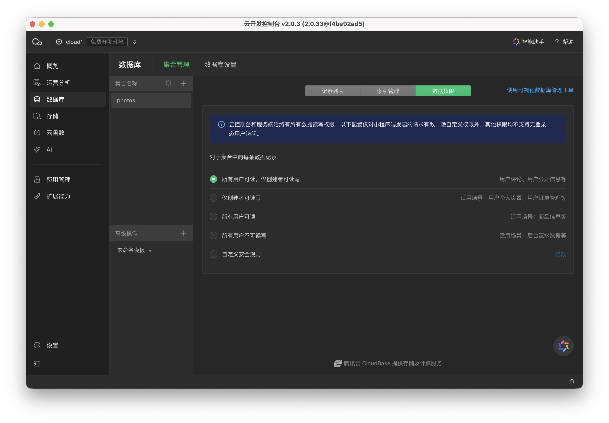

2. **注册页面文件并完成全局配置**。本项目共有4个页面：`index`（首页）、`homepage`（个人主页）、`detail`（图片展示页）、`add`（上传图片页），我在`app.json`的`pages`属性中依次注册，保存后自动生成各页面的js/json/wxml/wxss文件。同时我配置了`window`导航栏（标题"图片分享社区"、浅紫色背景、黑色文字）与底部`tabBar`（首页、上传图片、个人主页三栏），使三个主页面可以一键切换；`app.js`中我通过`wx.cloud.init({ traceUser: true })`完成云能力初始化，并在`globalData`中维护`userInfo`、`openid`等全局状态，封装了`getOpenId`（调用云函数获取openid）、`login`（登录并加载用户资料）、`logout`等全局方法供各页面复用。

   ```json
   // app.json 关键配置
   {
     "pages": [
       "pages/index/index",
       "pages/homepage/homepage",
       "pages/detail/detail",
       "pages/add/add"
     ],
     "window": {
       "navigationBarBackgroundColor": "#d9c9ee",
       "navigationBarTitleText": "图片分享社区",
       "navigationBarTextStyle": "black"
     },
     "tabBar": {
       "list": [
         { "pagePath": "pages/index/index", "text": "首页" },
         { "pagePath": "pages/add/add", "text": "上传图片" },
         { "pagePath": "pages/homepage/homepage", "text": "个人主页" }
       ]
     }
   }
   ```

   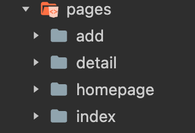

3. **编写公共样式表**。整体容器、卡片等样式在多个页面复用，因此我将它们写入公共样式表`app.wxss`：`.container`采用flex纵向布局并水平居中；`.card`定义卡片（宽度710rpx、圆角、半透明白底、柔和阴影）；`.card-head`为头像与昵称横排布局，`.avatar`圆形头像；`.card-body`与内部图片宽度100%；`.card-foot`横排展示标签与上传日期。各页面独有的样式我再写到对应页面的wxss文件中，无须重复声明。

4. **设计首页视图**。我设计了首页作为图片展示的核心区域，页面从上到下依次为：hero横幅（"发现生活里的光"标语）、标签筛选条（`scroll-view`横向滚动，"全部"+八种图片标签）、图片卡片列表与右上角浮动"分享"按钮。每张卡片由页眉（作者头像、昵称）、主体（图片）、页脚（标签、上传日期）三部分构成，用`wx:for`循环渲染。我计划使用的组件：容器组件`<view>`、图片组件`<image>`、文本组件`<text>`、按钮组件`<button>`、滚动组件`<scroll-view>`、跳转组件`<navigator>`。

   ```xml
   <!-- 卡片主体：点击图片跳转详情页 -->
   <navigator class="card-body" url="../detail/detail?id={{item._id}}">
     <image src="{{item.photoUrl}}" mode="widthFix" lazy-load="{{true}}"></image>
   </navigator>
   ```

   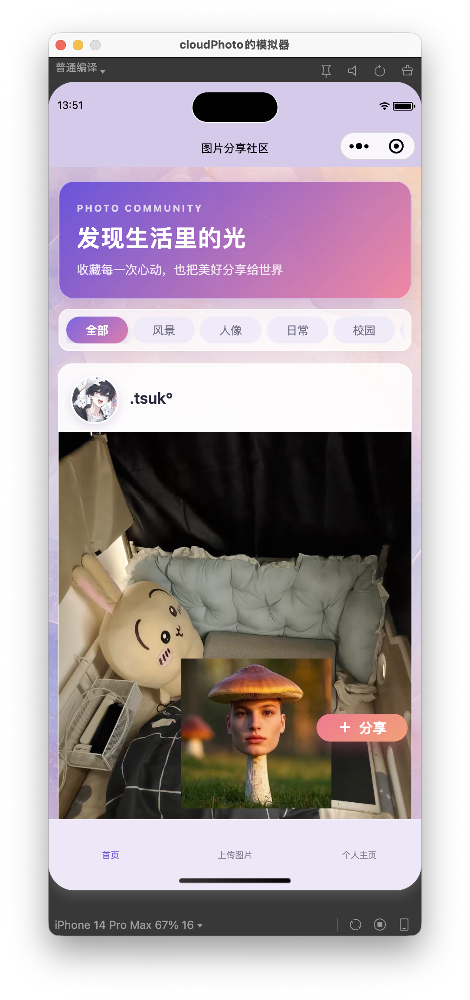

5. **设计个人主页、图片展示页与上传图片页视图**。我设计了三个页面的视图：个人主页顶部为头像昵称区域（`avatarBox`，头像圆形居中、昵称位于头像下方），下方复用与首页一致的卡片列表展示当前作者的作品，并提供"登录""修改头像和昵称""退出登录"入口；图片展示页顶部展示完整图片，下方为"下载到本地""分享图片""全屏预览"三个按钮（作者本人额外显示"删除图片"按钮）；上传图片页包含"上传图片"按钮、标签选择区与"已上传图片历史记录"九宫格区域，九宫格用`float: left`排列多张图片。

   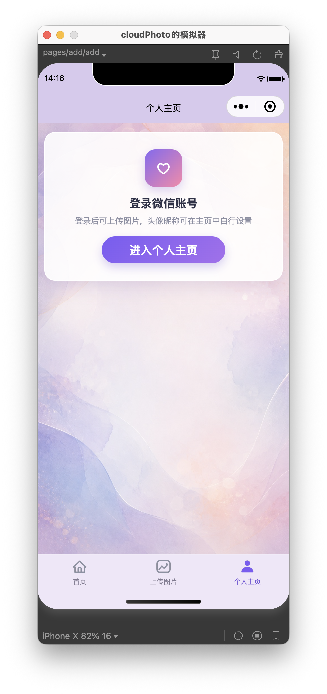

   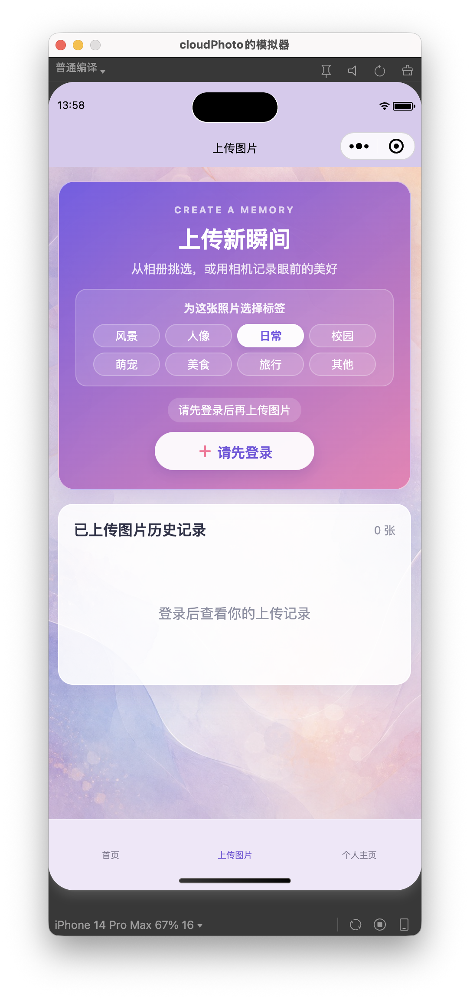

6. **实现用户个人信息获取逻辑**。上传图片与展示个人主页都需要当前用户的基础信息和`openid`。我将登录入口放在个人主页：点击"进入个人主页"按钮调用`app.login()`，其中`getOpenId()`通过云函数获取用户openid，`loadUserProfile()`优先读取本地缓存（`wx.getStorageSync('cloudPhotoProfile:openid')`），缓存为空时回源云数据库查询该用户最近一次作品的头像昵称，实现资料的持久化；头像昵称的修改我使用`<button open-type='chooseAvatar'>`与`<input type='nickname'>`组件收集新资料，保存后按openid写入缓存并同步更新云端作品信息。openid的获取依赖云函数：我在`cloudfunctions`下新建了Node.js云函数`getOpenid`，通过`cloud.getWXContext().OPENID`取得当前用户专属编号，右击"上传并部署：云端安装依赖"发布到云开发控制台后，在小程序端用`wx.cloud.callFunction`调用，首次获取后存入`app.globalData.openid`，后续直接复用避免重复请求。

   ```javascript
   // 云函数 getOpenid/index.js
   const cloud = require("wx-server-sdk");
   cloud.init({ env: cloud.DYNAMIC_CURRENT_ENV });
   exports.main = async () => {
     const context = cloud.getWXContext();
     return { openid: context.OPENID };
   };
   ```

   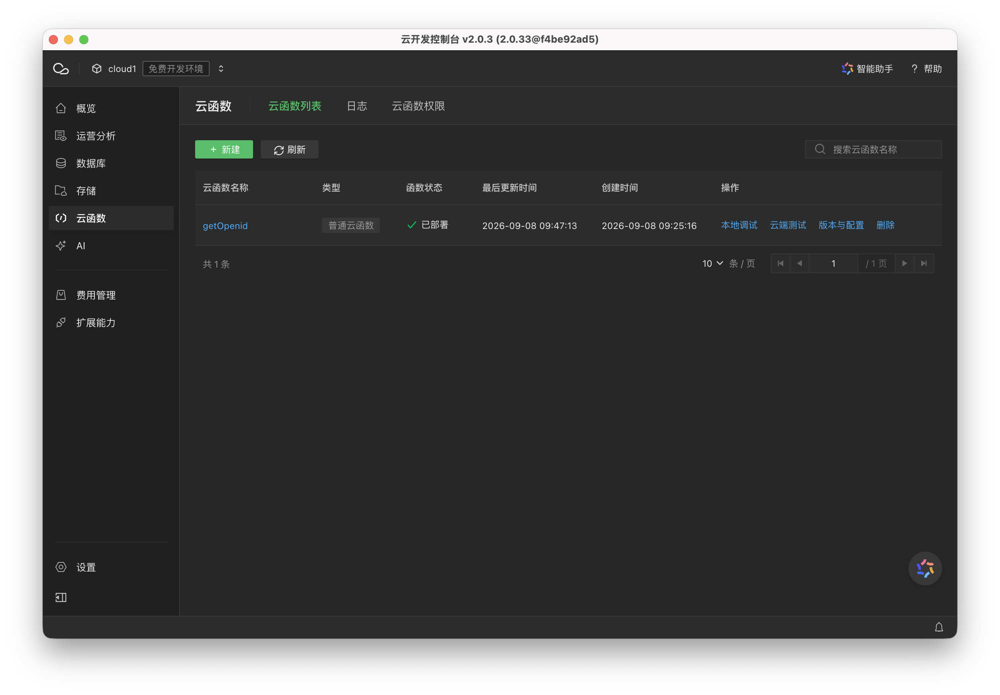

   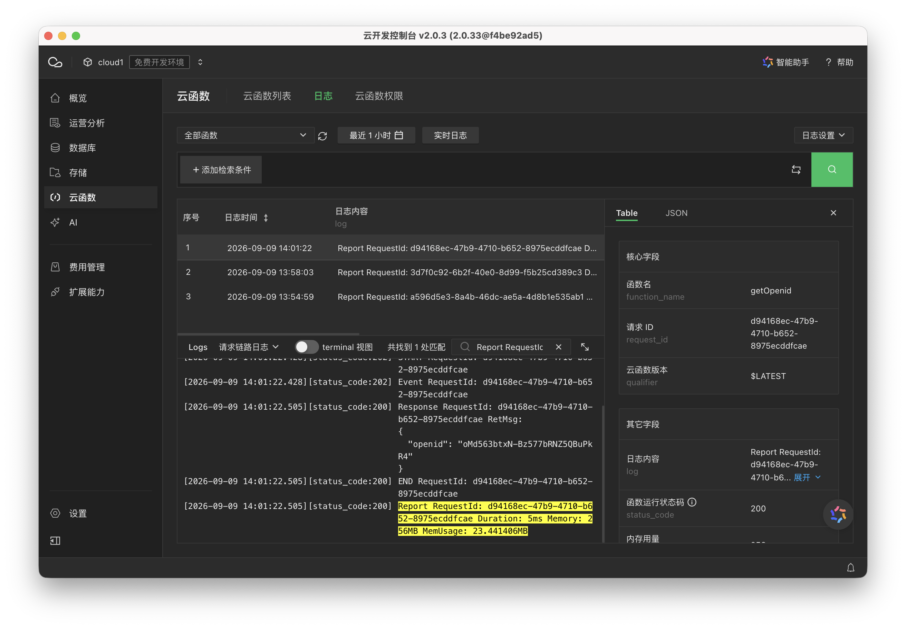

7. **实现图片上传逻辑**。上传图片页点击"上传图片"按钮后：先校验登录状态，未登录时弹出提示并引导跳转个人主页登录；已登录则用`wx.chooseImage`从相册/相机选择一张压缩图片，得到临时路径后调用`wx.cloud.uploadFile`上传到云存储，云端路径命名为`photos/时间戳-随机数.扩展名`（如`photos/1700000000000-123456.jpg`）；上传成功后调用`photos.add`将记录写入云数据库，字段包括`photoUrl`（云文件ID）、`avatarUrl`、`nickName`（取自全局用户信息）、`tag`（用户选择的标签）、`addDate`（`formatDate`格式化的当天日期`YYYY-MM-DD`）、`createdAt`（`db.serverDate()`云端时间）。上传过程我用`wx.showLoading`提示、完成后`wx.hideLoading`并刷新历史记录。

   ```javascript
   // add.js 图片上传核心逻辑
   const cloudPath = `photos/${Date.now()}-${Math.floor(Math.random() * 1000000)}${suffix}`;
   wx.cloud.uploadFile({
     cloudPath,
     filePath,
     success: (res) => {
       photos.add({
         data: {
           photoUrl: res.fileID,
           avatarUrl: userInfo.avatarUrl || "",
           nickName: userInfo.nickName || "微信用户",
           tag: this.data.selectedTag,
           addDate: formatDate(),
           createdAt: db.serverDate(),
         },
         success: () => { wx.showToast({ title: "上传成功" }); this.getHistoryPhotos(true); },
       });
     },
   });
   ```

   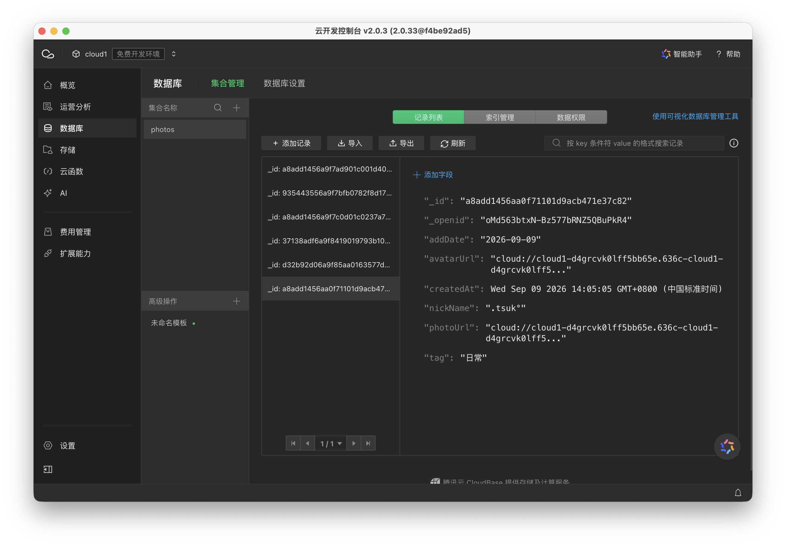

8. **实现图片历史记录展示**。云数据库在添加记录时会自动登记当前用户的`_openid`字段，因此只需筛选出`_openid`与当前用户匹配的数据即可获取本人的上传记录。我在`add.js`中实现了`getHistoryPhotos`：`photos.orderBy('createdAt','desc').where({ _openid: userId }).skip(offset).limit(30).get()`分页查询，结果存入`historyPhotos`；`add.wxml`用`wx:for`循环渲染九宫格，点击任意图片调用`wx.previewImage`全屏预览；在`onShow`（页面打开）与`upload`（上传成功后）中分别调用该方法，保证历史记录始终最新。

   ```javascript
   // add.js 获取当前用户历史记录
   photos.orderBy("createdAt", "desc").where({ _openid: userId })
     .skip(offset).limit(PAGE_SIZE).get()
     .then((res) => this.setData({ historyPhotos: res.data, ... }));
   ```

   ```xml
   <!-- add.wxml 历史记录九宫格 -->
   <block wx:for="{{historyPhotos}}" wx:key="_id">
     <image src="{{item.photoUrl}}" mode="aspectFill" data-url="{{item.photoUrl}}" bindtap="previewHistory"></image>
   </block>
   ```

   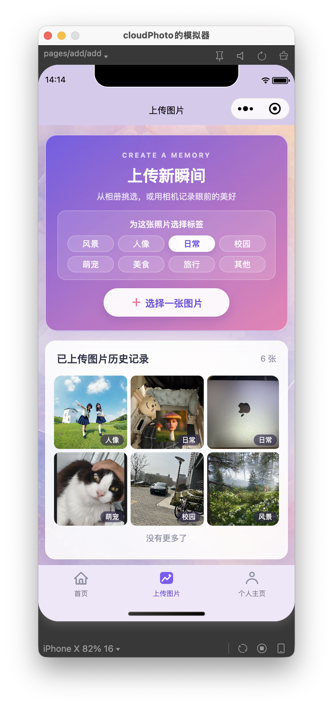

9. **实现首页图片列表展示与页面跳转**。我在`index.js`中实现了`loadPhotos`分页查询：按当前选中的标签（"全部"则不附加条件，否则`where({ tag })`）、`orderBy('createdAt','desc')`、`skip(offset).limit(10)`从云数据库读取图片列表并渲染卡片；在`onShow`中刷新列表，保证从其他页面返回首页时图片保持最新，并支持下拉刷新（`onPullDownRefresh`）与触底加载更多（`onReachBottom`）。点击卡片头像我通过`openAuthor`将作者`openid`存入`app.globalData.profileOpenid`并`wx.switchTab`跳转个人主页，点击卡片图片通过`<navigator url='../detail/detail?id={{item._id}}'>`跳转图片展示页并携带图片id。

   ```javascript
   // index.js 首页图片列表查询（标签筛选 + 分页）
   let query = photos;
   if (activeTag !== "全部") query = query.where({ tag: activeTag });
   query.orderBy("createdAt", "desc").skip(offset).limit(PAGE_SIZE).get({ ... });
   ```

   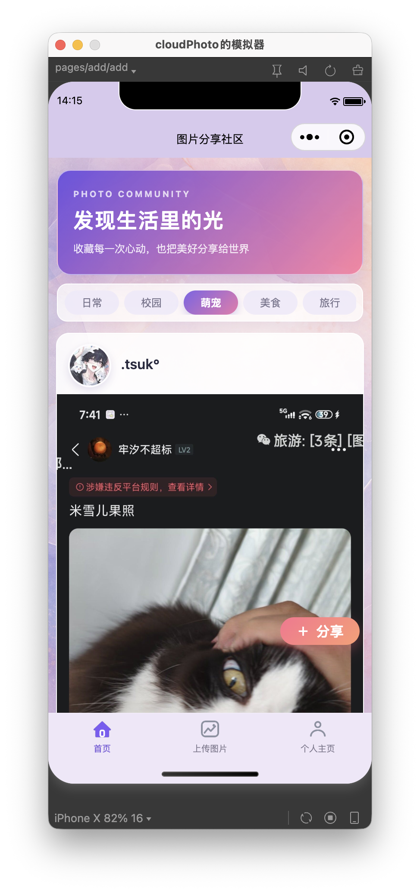

10. **实现个人主页逻辑**。`homepage`页面`onLoad`读取跳转参数`id`（被查看作者的openid），`onShow`中判断当前查看的是本人还是其他作者：查看本人时我通过`app.login()`完成登录（云函数取openid+从缓存或云端加载头像昵称）；"修改头像和昵称"入口打开资料编辑表单，临时头像先上传至`avatars/`路径，再连同昵称一起通过`app.saveUserProfile`写入缓存，并`photos.where({ _openid }).update`同步更新该用户所有作品的`avatarUrl`与`nickName`；作品列表按openid查询（`orderBy('createdAt','desc')`、分页加载），顶端头像昵称取`photoList`中的作者信息展示，并统计"共分享N张图片"。

    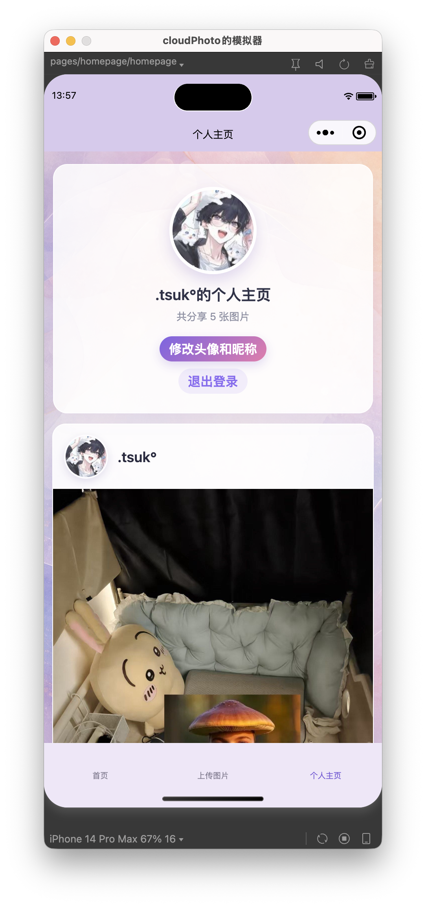

11. **实现图片展示页逻辑**。`detail`页面`onLoad`中我通过`photos.doc(options.id).get()`根据图片id查询记录并展示完整图片与作者、标签、日期信息；"下载到本地"我先`wx.cloud.downloadFile`从云存储下载图片到临时路径，再`wx.saveImageToPhotosAlbum`保存到本地相册（模拟器会弹出授权弹窗，真机直接保存）；"分享图片"下载后调用`wx.showShareImageMenu`呼出系统图片分享菜单；"全屏预览"使用`wx.previewImage`；"删除图片"仅作者本人可见，我依次调用`photos.doc(id).remove`删除数据库记录、`wx.cloud.deleteFile`删除云存储文件，成功后返回上一页。

    ```javascript
    // detail.js 下载图片到本地
    wx.cloud.downloadFile({
      fileID: this.data.photo.photoUrl,
      success: (res) => {
        wx.saveImageToPhotosAlbum({
          filePath: res.tempFilePath,
          success: () => wx.showToast({ title: "保存成功" }),
          fail: () => wx.showToast({ title: "保存失败", icon: "none" }),
        });
      },
    });
    ```

    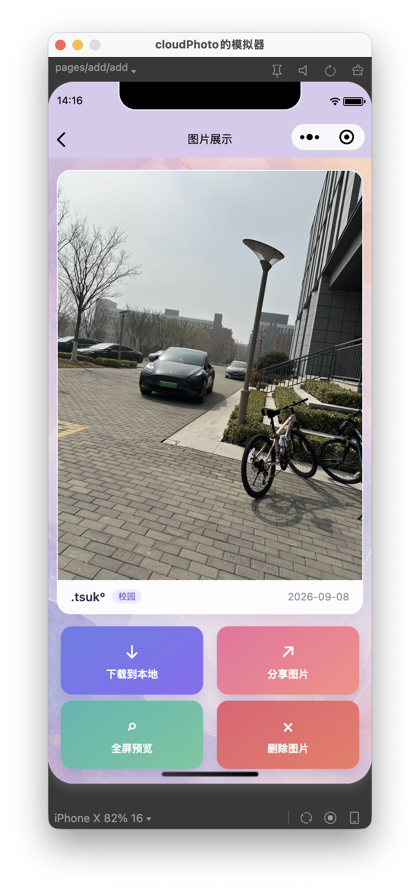

12. **运行调试与验证**。我在微信开发者工具模拟器与真机预览中运行项目：从首页点击浮动按钮跳转上传图片页，选择并上传多张带不同标签的测试图片；返回首页验证卡片列表按上传时间倒序展示、标签筛选、下拉刷新与触底分页；进入个人主页验证登录、资料修改与作品列表；进入详情页验证下载、分享、全屏预览与作者删除；同时打开云开发控制台核对`photos`集合记录与云存储中的图片文件。

### （四）核心代码片段

#### 1. getOpenid云函数（cloudfunctions/getOpenid/index.js）

```javascript
const cloud = require("wx-server-sdk");

cloud.init({ env: cloud.DYNAMIC_CURRENT_ENV });

exports.main = async () => {
  const context = cloud.getWXContext();
  return { openid: context.OPENID };
};
```

#### 2. add.js图片上传与记录写入（节选）

```javascript
uploadPhoto(filePath) {
  const suffix = (filePath.match(/\.[^.]+$/) || [".jpg"])[0];
  const cloudPath = `photos/${Date.now()}-${Math.floor(Math.random() * 1000000)}${suffix}`;
  this.setData({ uploading: true });
  wx.showLoading({ title: "上传中", mask: true });
  wx.cloud.uploadFile({
    cloudPath,
    filePath,
    success: (res) => this.savePhoto(res.fileID),
    fail: () => {
      this.finishUpload();
      wx.showToast({ title: "上传失败", icon: "none" });
    },
  });
},

savePhoto(fileID) {
  const userInfo = app.globalData.userInfo || {};
  photos.add({
    data: {
      photoUrl: fileID,
      avatarUrl: userInfo.avatarUrl || "",
      nickName: userInfo.nickName || "微信用户",
      tag: this.data.selectedTag,
      addDate: formatDate(),
      createdAt: db.serverDate(),
    },
    success: () => {
      wx.showToast({ title: "上传成功" });
      this.getHistoryPhotos(true);
    },
  });
},
```

#### 3. index.js首页图片列表分页查询（含标签筛选）

```javascript
loadPhotos(reset = true) {
  ...
  let query = photos;
  if (activeTag !== "全部") query = query.where({ tag: activeTag });
  query.orderBy("createdAt", "desc").skip(offset).limit(PAGE_SIZE).get({
    success: (res) => {
      const next = res.data.map(formatPhoto);
      this.setData({
        photoList: reset ? next : this.data.photoList.concat(next),
        hasMore: next.length === PAGE_SIZE,
      });
    },
    ...
  });
}
```

#### 4. detail.js下载图片到本地

```javascript
downloadPhoto() {
  wx.cloud.downloadFile({
    fileID: this.data.photo.photoUrl,
    success: (res) => {
      wx.saveImageToPhotosAlbum({
        filePath: res.tempFilePath,
        success: () => wx.showToast({ title: "保存成功" }),
        fail: () => wx.showToast({ title: "保存失败", icon: "none" }),
      });
    },
    fail: () => wx.showToast({ title: "下载失败", icon: "none" }),
  });
}
```

#### 5. index.wxml首页卡片列表渲染（节选）

```xml
<block wx:for="{{photoList}}" wx:key="_id">
  <view class="card">
    <view class="card-head">
      <view class="author-link" data-openid="{{item._openid}}" bindtap="openAuthor">
        <image wx:if="{{item.avatarUrl}}" class="avatar" src="{{item.avatarUrl}}" mode="aspectFill"></image>
        <view wx:else class="avatar avatar-fallback">{{item.initial}}</view>
      </view>
      <view class="title">
        <text class="nickName">{{item.nickName}}</text>
      </view>
    </view>
    <navigator class="card-body" url="../detail/detail?id={{item._id}}">
      <image src="{{item.photoUrl}}" mode="widthFix" lazy-load="{{true}}"></image>
    </navigator>
    <view class="card-foot">
      <text class="card-tag">{{item.tag}}</text>
      <text>{{item.addDate}}</text>
    </view>
  </view>
</block>
```

### （五）实验结果

编译并运行项目，上传了多张带不同标签的本地测试图片，验证结果如下：

- 首页以卡片流形式正确展示云存储中的图片与作者信息，按上传时间倒序、最新图片置顶；标签筛选、下拉刷新、触底分页加载均正常，点击头像可进入作者主页、点击图片可进入详情页；
- 上传图片页可正常选择图片上传，上传成功后云数据库`photos`集合新增记录、云存储出现对应文件，页面九宫格历史记录实时刷新，点击图片可全屏预览；
- 未登录时上传页会提示先登录、不能上传图片，个人主页只显示登录引导、不展示任何作品内容；
- 个人主页可微信登录，正确展示头像、昵称与作品数量；修改头像昵称后个人资料与云端所有作品信息同步更新；
- 图片展示页正确显示图片及作者、标签、日期信息，下载到本地、分享给好友、全屏预览功能正常，作者本人可删除自己的图片（数据库记录与云存储文件同步删除）；
- 控制台验证用户基础信息与openid均能成功获取。


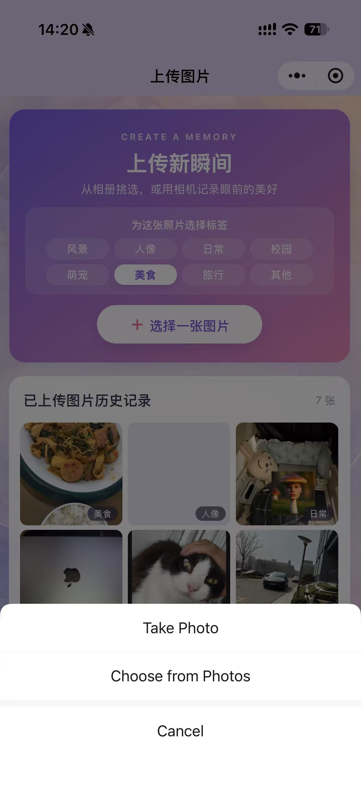


## 二、问题总结与体会

本次实验属于微信小程序云开发综合实验，我结合云数据库、云存储与云函数，完整实现了一个图片分享社区小程序。开发过程中我遇到了若干问题，包括页面登录态控制、上传逻辑校验、图片列表排序与页面跳转等，通过阅读实验文档、分析运行日志与反复调试逐一解决。

#### 第一个遇到的问题：个人主页（homepage）未登录时，页面下方仍然显示了该用户已上传的内容。

未登录状态下进入个人主页，页面底部仍会渲染出作品列表区域（残留上一次的数据或空态提示），与"未登录不展示个人内容"的预期不符。排查发现根因有二：一是`onShow`中未对登录状态做完整判断，未登录分支没有把`photoList`、`author`、`loading`等页面数据全部复位；二是WXML中没有把"登录引导区"与"作品内容区"彻底隔离开，内容区仍会被渲染。修复：在`onShow`开头统一判断`app.globalData.userInfo`，未登录时一次性复位`openid`、`author`、`photoList`及分页状态；同时把作品内容区整体包在`wx:if="{{!isSelf || loggedIn}}"`条件块中——仅当已登录（查看本人）或正在查看其他作者（无需登录）时才渲染，未登录时只显示登录引导卡片。

#### 第二个遇到的问题：上传图片页未登录时仍可上传，且历史记录没有与用户ID绑定。

起初上传按钮未做登录校验，未登录时也能选择图片并上传，导致记录写入云端时取不到有效的用户信息；同时历史记录查询没有按用户过滤，所有用户的上传图片都混在同一个列表里。修复：在`upload`函数开头先校验`app.globalData.userInfo`，未登录时用`wx.showModal`提示"请先登录"，点击"去登录"后`wx.switchTab`跳转个人主页；历史记录改为按当前用户openid过滤——云数据库在写入记录时会自动登记`_openid`字段，`getHistoryPhotos`中通过`photos.where({ _openid: userId })`只读取当前用户的记录，未登录时直接清空列表并显示"登录后查看你的上传记录"，从而保证历史记录与用户ID严格绑定。

#### 第三个遇到的问题：图片列表排序不对，最新上传的图片没有置顶。

这是本次实验中最关键的一个问题。最初首页、上传页历史记录与个人主页三处的列表查询没有统一按时间倒序处理，展示顺序不一致，新上传的图片有时出现在列表底部，与"最新上传置顶"的预期相悖。修复：三处查询统一改为按云端时间戳倒序排序`photos.orderBy('createdAt','desc')`，其中首页与个人主页再叠加分页查询（`skip`/`limit`）；上传记录写入时用`db.serverDate()`生成云端时间`createdAt`，避免使用本地时间造成排序误差；同时我在云开发控制台为`photos`创建了`tag`+`createdAt`、`_openid`+`createdAt`两组联合索引，保证"按标签筛选+时间倒序""按用户筛选+时间倒序"的组合查询能正常返回排序结果；上传成功后立即刷新历史记录，确保最新图片始终出现在九宫格最顶端。

#### 第四个遇到的问题：首页跳转上传页/个人主页时页面跳转失败，控制台报错"can not navigateTo a tabbar page"。

我将首页、上传图片页、个人主页设计为tabBar页面后，初期仍沿用`wx.navigateTo`跳转，运行时提示无法导航到tabBar页面，跳转静默失败。排查后我确认：tabBar页面必须使用`wx.switchTab`跳转（且不允许携带url参数），而只有非tabBar页面（如detail详情页）才能用`wx.navigateTo`并携带id参数。修复：`goToAdd`、`openAuthor`改用`wx.switchTab`跳转；由于`switchTab`不能传参，我将被查看作者的openid暂存到`app.globalData.profileOpenid`，个人主页`onShow`时读取该值再展示对应作者的作品，而详情页的图片id则继续通过`wx.navigateTo`的url参数传递。

本次实验让我完整走通了"前端页面+云数据库+云存储+云函数"的全栈小程序开发流程，也深刻体会到云开发的"数据权限"与"身份标识"设计：`_openid`自动登记机制让"用户自己的数据"查询变得简单可靠，而登录态的控制则是所有页面功能正确的前提。同时，"最新置顶"这类看似简单的排序需求，实际涉及查询排序字段、云端时间戳、联合索引等多个环节，任何一个环节缺失都会导致结果不符合预期；tabBar与`navigateTo`的限制也提醒我要先理解框架约定再动手实现。
